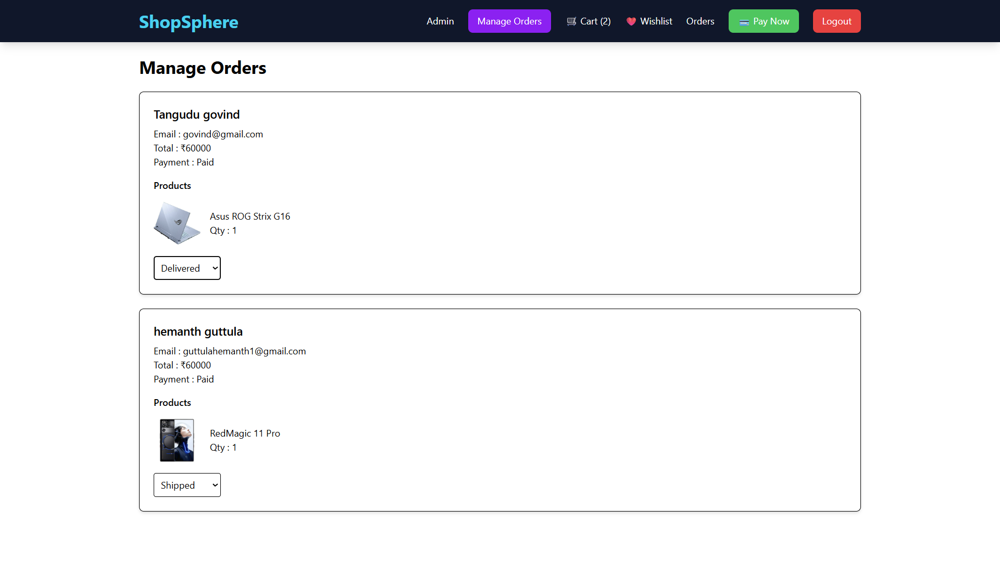

#Shopsphere
A full-stack MERN E-Commerce platform with authentication, product management, cart, wishlist, Razorpay integration, and an admin dashboard.

##Project Structure
```text
ShopSphere_Frontend/
│
├── screenshots/
├── src/
│   ├── api/
│   ├── components/
│   ├── layouts/
│   ├── pages/
│   ├── redux/
│   ├── routes/
│   ├── App.jsx
│   ├── main.jsx
│   └── index.css
```

###Banner
<p align="center">
    
</p>

###Home page
<p align="center">
  
</p>

### Product
<p align="center">
  
</p>

### Cart
<p align="center">
  
</p>

### Wishlist
<p align="center">
  
</p>

### Orders
<p align="center">
  
</p>

### Admin Dash board
<p align="center">
  
</p>

### Add product
<p align="center">
  
</p>

### Product update&delete
<p align="center">
  
</p>

### Manage Orders
<p align="center">
  
</p>

## 📋 Prerequisites

Before running this project, ensure you have:

- Node.js (v18 or later)
- npm
- MongoDB Atlas account
- Cloudinary account
- Razorpay account (for payments)
- Git

## 🛠️ Installation

### 1. Clone the Repository

```bash
git clone https://github.com/HemanthGuttula-1/Shopsphere_Frontend.git
```

### 2. Navigate to the Project Directory

```bash
cd ShopSphere
```

### 3. Install Frontend Dependencies

```bash
cd Shopsphere_Frontend
npm install
```

### 4. Start the Frontend

```bash
npm run dev
```

The frontend will be available at:

```
http://localhost:5173
```

### 5. Install Backend Dependencies

Open a new terminal and run:

```bash
cd Shopsphere_Backend
npm install
```

### 6. Configure Environment Variables

Create a `.env` file inside the `Shopsphere_Backend` folder and add:

```env
PORT=5000
MONGO_URI=your_mongodb_connection_string
JWT_SECRET=your_jwt_secret

CLOUDINARY_CLOUD_NAME=your_cloud_name
CLOUDINARY_API_KEY=your_api_key
CLOUDINARY_API_SECRET=your_api_secret

RAZORPAY_KEY_ID=your_razorpay_key
RAZORPAY_KEY_SECRET=your_razorpay_secret
```

### 7. Start the Backend Server

```bash
npm start
```

or, if you use Nodemon:

```bash
npm run dev
```

The backend server will run at:

```
http://localhost:5000
```

### 8. Open the Application

Open your browser and visit:

```
http://localhost:5173
```

The frontend will communicate with the backend running on port `5000`.


## API End points

| Method | Endpoint       | Description  |
| ------ | -------------- | ------------ |
| POST   | /auth/login    | Login        |
| POST   | /auth/register | Register     |
| GET    | /products      | Get Products |
| POST   | /cart/add      | Add Cart     |
| PUT    | /cart/update   | Update Cart  |

# Environment Variables
 
## Backend

PORT=

MONGO_URI=

JWT_SECRET=

CLOUDINARY_NAME=

CLOUDINARY_KEY=

CLOUDINARY_SECRET=

RAZORPAY_KEY=

RAZORPAY_SECRET=

## Frontend Environment Variables

Create a `.env` file inside `Shopsphere_Frontend`:

```env
VITE_BASE_URL=http://localhost:5000/api
VITE_RAZORPAY_KEY=
```

## Simple Architecture
```text
React Frontend
      │
 REST API
      │
Express Server
      │
Business Logic
      │
MongoDB Atlas
      │
Cloudinary
```

## Performance Highlights
```text
Responsive UI across desktop and mobile
Lazy loading where implemented
Optimized API calls
Secure password hashing with bcrypt
JWT-based authentication
Image storage using Cloudinary
```

# Author
---Hemanth Guttula